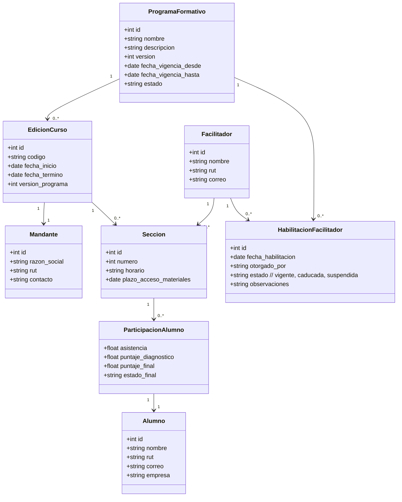
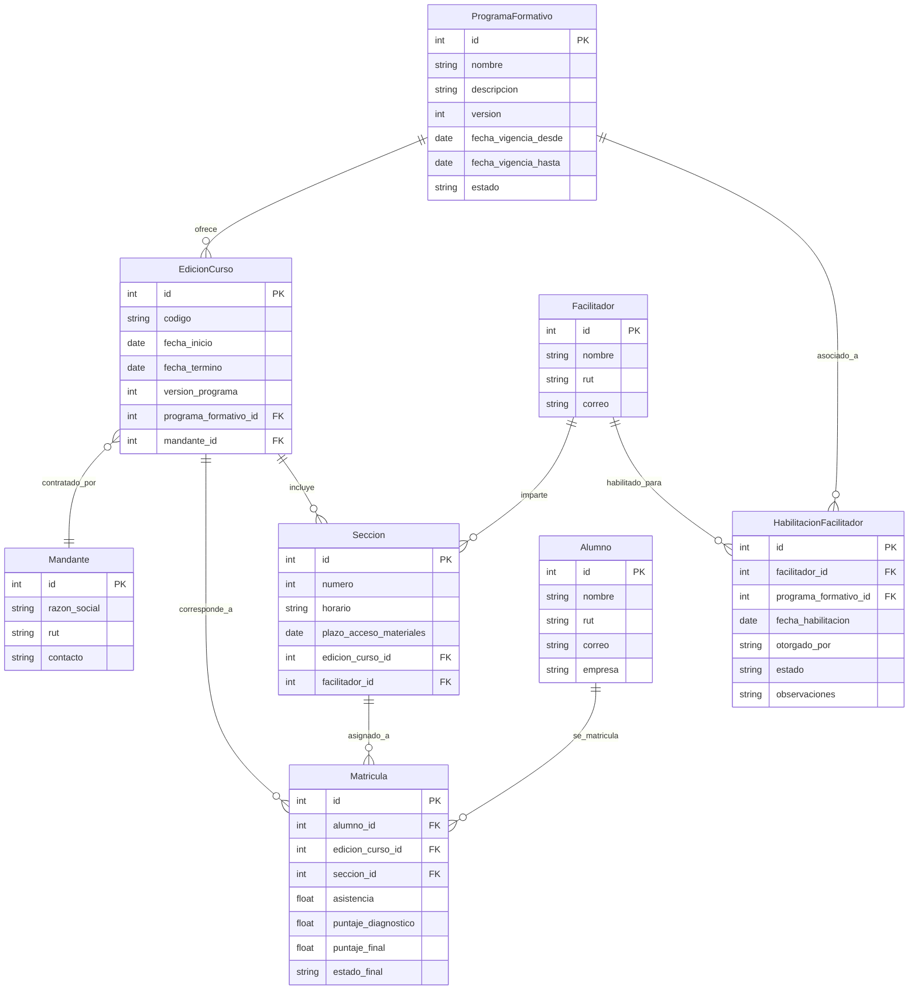

# OTEC TuFuturo - Sistema Académico

## Contexto
OTEC TuFuturo es una organización recientemente creada cuyo propósito es brindar formación virtual a trabajadores en materias de salud y seguridad ocupacional en operaciones mineras.

Con este objetivo, la organización ha solicitado el desarrollo de un sistema académico que permita registrar y gestionar las actividades de capacitación impartidas, incluyendo programas formativos, sus ediciones, mandantes, facilitadores y alumnos. El sistema deberá registrar además la participación individual de los alumnos, su asistencia, puntajes en evaluaciones diagnósticas y finales, así como el estado final de aprobación o reprobación del curso.

## Características del Negocio
Cada programa formativo corresponde a una materia específica (por ejemplo, Ley 16.744, Ley 21.643, Uso y manejo de extintores, entre otros) y podrá tener múltiples versiones, según se requiera su actualización por cambios en la normativa o contenidos pedagógicos.

Los programas se ofrecen a través de ediciones de curso, que pueden impartirse varias veces al año y ser contratadas por uno o varios mandantes. Un mismo mandante puede solicitar múltiples ediciones durante el año, pero no se permitirá mezclar alumnos de distintos mandantes en una misma clase.

Dado que cada clase admite un máximo de 20 participantes, los alumnos de un mandante serán divididos en una o más secciones, según corresponda. Cada sección contará con un facilitador, quien debe estar habilitado para impartir uno o varios programas formativos. Un mismo facilitador puede estar a cargo de varias secciones, siempre que no se superpongan en el horario.

## Diagrama de Clases

## Diagrama ER

