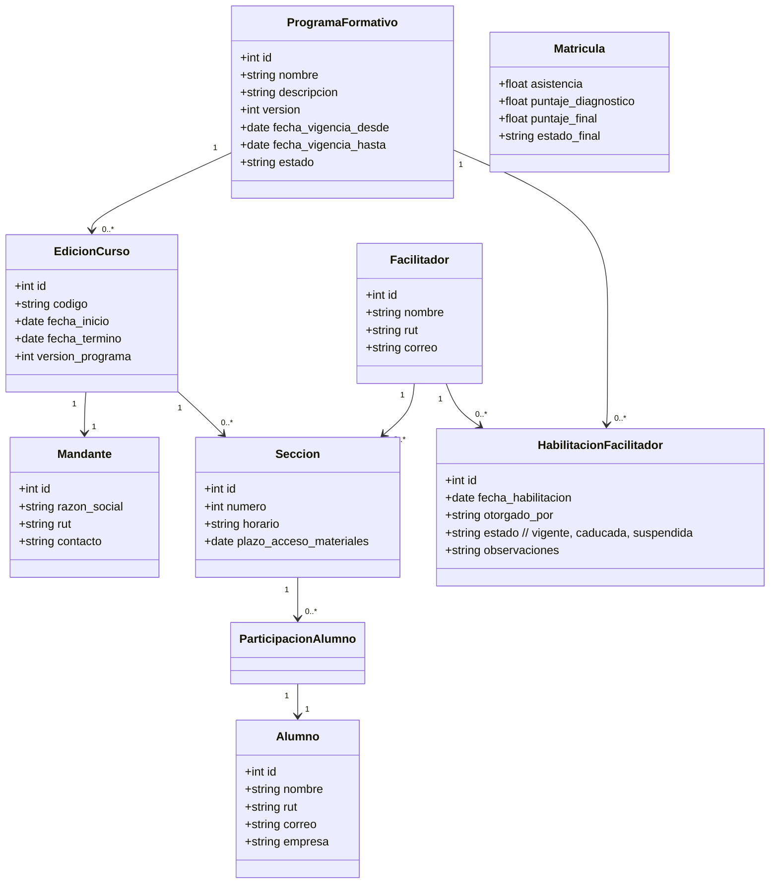
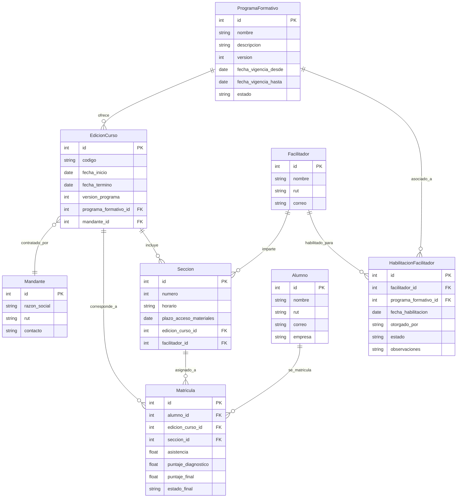

# OTEC TuFuturo - Sistema Académico

## Introducción y Contexto
OTEC TuFuturo es una organización recientemente creada cuyo propósito es brindar formación virtual a trabajadores en materias de salud y seguridad ocupacional en operaciones mineras.

Con este objetivo, la organización ha solicitado el desarrollo de un sistema académico que permita registrar y gestionar las actividades de capacitación impartidas, incluyendo programas formativos, sus ediciones, mandantes, facilitadores y alumnos. El sistema deberá registrar además la participación individual de los alumnos, su asistencia, puntajes en evaluaciones diagnósticas y finales, así como el estado final de aprobación o reprobación del curso.

## Características del Negocio
Cada programa formativo corresponde a una materia específica (por ejemplo, Ley 16.744, Ley 21.643, Uso y manejo de extintores, entre otros) y podrá tener múltiples versiones, según se requiera su actualización por cambios en la normativa o contenidos pedagógicos.

Los programas se ofrecen a través de ediciones de curso, que pueden impartirse varias veces al año y ser contratadas por uno o varios mandantes. Un mismo mandante puede solicitar múltiples ediciones durante el año, pero no se permitirá mezclar alumnos de distintos mandantes en una misma clase.

Dado que cada clase admite un máximo de 20 participantes, los alumnos de un mandante serán divididos en una o más secciones, según corresponda. Cada sección contará con un facilitador, quien debe estar habilitado para impartir uno o varios programas formativos. Un mismo facilitador puede estar a cargo de varias secciones, siempre que no se superpongan en el horario.

---

# Documento de Visión Funcional – Sistema Académico OTEC TuFuturo

## 1. Nombre del proyecto

**Sistema Académico para Gestión de Capacitación – OTEC TuFuturo**

## 2. Descripción general

**OTEC TuFuturo** es un organismo técnico de capacitación recientemente creado, cuyo objetivo es ofrecer formación virtual a trabajadores en materias de salud y seguridad ocupacional en operaciones mineras.

Con este sistema se busca apoyar la gestión académica de los procesos de capacitación, facilitando la administración de programas formativos, cursos impartidos, facilitadores, alumnos y empresas clientes, así como el registro de la participación, evaluación y resultados de los alumnos.

## 3. Objetivo del sistema

Desarrollar una plataforma web interna para registrar, organizar y consultar información asociada a los cursos impartidos por el OTEC, incluyendo:

* Definición de programas formativos y sus versiones.
* Creación de ediciones de curso específicas para empresas clientes.
* División de cursos en secciones según el número de alumnos.
* Asignación de facilitadores habilitados a las secciones.
* Registro de matrícula de alumnos por sección.
* Registro de asistencia, evaluaciones y resultados de los alumnos.

## 4. Actores y usuarios esperados

| Rol                         | Descripción                                                                                                                     |
| --------------------------- | ------------------------------------------------------------------------------------------------------------------------------- |
| **Administrador Académico** | Usuario interno responsable de gestionar programas, cursos, secciones, facilitadores y alumnos. Accede a toda la funcionalidad. |
| **Facilitador**             | Encargado de impartir secciones. Registra asistencia y notas. Puede ver solo sus cursos asignados.                              |
| **Empresa Cliente**         | Entidad que solicita la capacitación. No interactúa directamente con el sistema en esta etapa.                                  |
| **Alumno**                  | Persona capacitada. Su información es administrada por el sistema, pero no tiene acceso directo en esta versión.                |

## 5. Funcionalidades incluidas en el MVP

* Gestión de **programas formativos** y sus versiones.
* Gestión de **facilitadores** y su habilitación para programas específicos.
* Gestión de **empresas clientes**.
* Creación de **ediciones de curso** (instancias anuales/por cliente).
* División de ediciones en **secciones** según número de alumnos.
* Asignación de **facilitadores a secciones**.
* Registro de **alumnos** por parte del administrador.
* **Matrícula** de alumnos en ediciones y asignación automática a secciones.
* Registro de **asistencia y evaluaciones ** por parte del facilitador.
* Cálculo del **estado final del alumno** (aprobado/reprobado).

## 6. Funcionalidades excluidas (fuera de alcance MVP)

* Portal de autoservicio para alumnos o empresas clientes.
* Notificaciones por correo o mensajería.
* Reportes avanzados o descargables.
* Control de versiones legales automatizado.
* Integración con SENCE u otras plataformas externas.
* Gestión de usuarios, autenticación y roles con privilegios diferenciados (se asumirá acceso pleno por ahora).

## 7. Restricciones técnicas

* Se priorizará una solución web funcional, sin dependencias externas complejas.
* El sistema puede operar en modo local o desplegarse en un servidor básico (VPS o nube).
* No se contempla por ahora el uso de frameworks pesados o arquitecturas distribuidas.

## 8. Valor para la organización

* Centralización y trazabilidad de los cursos impartidos.
* Mejora en la asignación de recursos humanos (facilitadores).
* Facilita el cumplimiento normativo en capacitación de trabajadores.
* Permite escalar las operaciones y responder a múltiples clientes con control interno.

## 9. Indicadores de éxito del MVP

* Se puede crear un programa formativo, una edición, secciones y matrículas sin intervención técnica.
* Se pueden registrar y consultar evaluaciones de los alumnos.
* El sistema permite distinguir qué facilitadores están habilitados para cada programa.
* El equipo interno puede operar el sistema con mínima capacitación.

---

## Diagrama de Clases

## Diagrama ER

