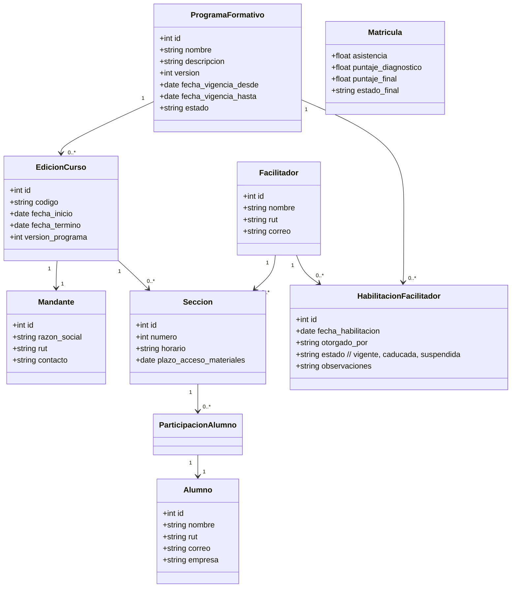

## Diagrama de Clases

```mermaid
classDiagram
    class ProgramaFormativo {
        +int id
        +string nombre
        +string descripcion
        +int version
        +date fecha_vigencia_desde
        +date fecha_vigencia_hasta
        +string estado
    }

    class EdicionCurso {
        +int id
        +string codigo
        +date fecha_inicio
        +date fecha_termino
        +int version_programa
    }

    class Mandante {
        +int id
        +string razon_social
        +string rut
        +string contacto
    }

    class Seccion {
        +int id
        +int numero
        +string horario
        +date plazo_acceso_materiales
    }

    class Facilitador {
        +int id
        +string nombre
        +string rut
        +string correo
    }

    class HabilitacionFacilitador {
        +int id
        +date fecha_habilitacion
        +string otorgado_por
        +string estado  // vigente, caducada, suspendida
        +string observaciones
    }

    class Alumno {
        +int id
        +string nombre
        +string rut
        +string correo
        +string empresa
    }

    class Matricula {
        +float asistencia
        +float puntaje_diagnostico
        +float puntaje_final
        +string estado_final
    }


    %% Relaciones
    ProgramaFormativo "1" --> "0..*" EdicionCurso
    EdicionCurso "1" --> "1" Mandante
    EdicionCurso "1" --> "0..*" Seccion
    Facilitador "1" --> "0..*" Seccion
    Seccion "1" --> "0..*" ParticipacionAlumno
    ParticipacionAlumno "1" --> "1" Alumno

    Facilitador "1" --> "0..*" HabilitacionFacilitador
    ProgramaFormativo "1" --> "0..*" HabilitacionFacilitador
```