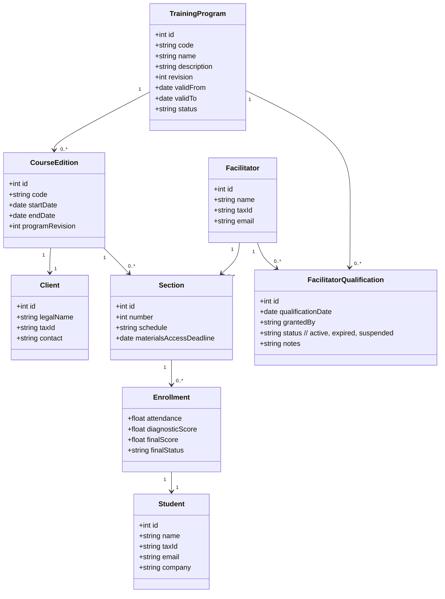
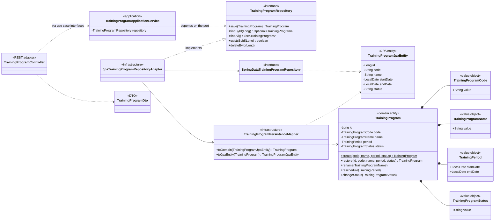

## Class Diagram

Conceptual domain model of the full academic system. For how the implemented
`TrainingProgram` slice is actually structured in code, see
[Implementation: the TrainingProgram slice](#implementation-the-trainingprogram-slice)
below.

---

## Implementation: the TrainingProgram slice

The diagram above is the **conceptual domain model** of the full academic
system. Most of it is not implemented yet.

`TrainingProgram` *is* implemented, and from Milestone 3 it is built as a Clean
Architecture vertical slice. The single `TrainingProgram` class of the diagram
above is now realised as two distinct classes — the domain model and its JPA
representation — separated by a port and an adapter.

See [`architecture/clean-architecture.md`](architecture/clean-architecture.md)
for the reasoning.

Reading the diagram:

- `TrainingProgram` (domain) holds Value Objects, not primitives, and changes
  only through `rename` / `reschedule` / `changeStatus`.
- `TrainingProgramJpaEntity` holds primitives and is the only class mapped to
  the `training_program` table. It is anemic on purpose.
- `TrainingProgramRepository` is declared in `domain` and implemented in
  `infrastructure`. That single inverted arrow is what keeps the domain free of
  Spring and JPA.
- The controller depends on the use case interfaces the application service
  implements; it never reaches a repository.

The **ER diagram** in [`diag-er.md`](diag-er.md) is unchanged: the domain / JPA
split is a Java-side concern and the `training_program` table and columns are
exactly as Flyway `V1`–`V5` left them. No migration was added for this refactor.
