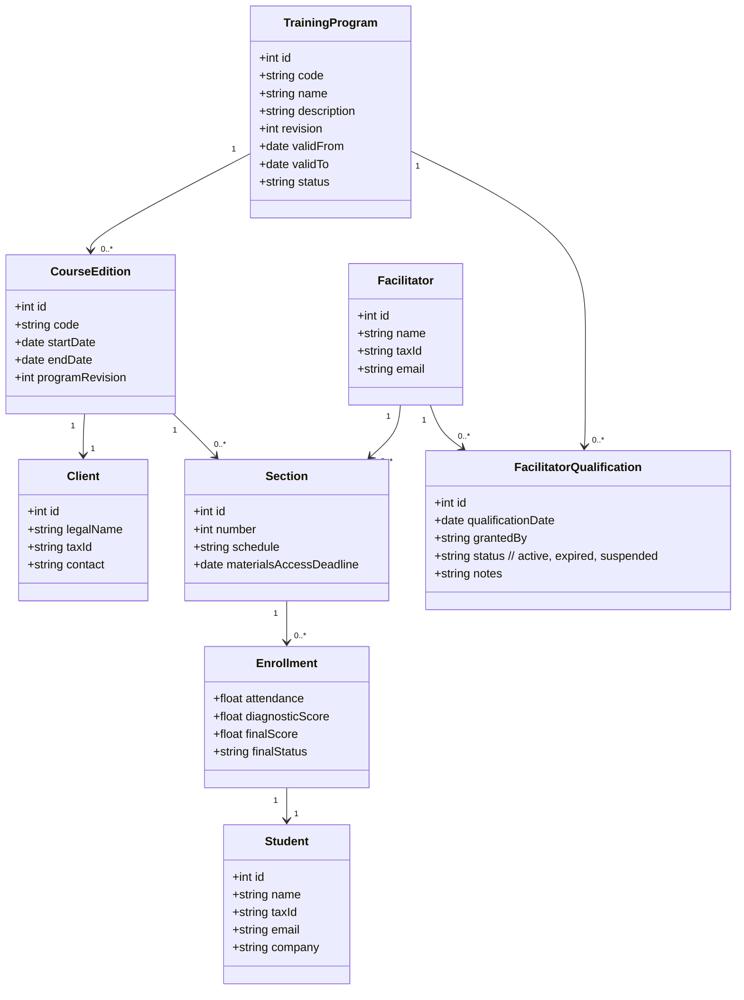

## Class Diagram

```mermaid
classDiagram
    class TrainingProgram {
        +int id
        +string code
        +string name
        +string description
        +int revision
        +date validFrom
        +date validTo
        +string status
    }

    class CourseEdition {
        +int id
        +string code
        +date startDate
        +date endDate
        +int programRevision
    }

    class Client {
        +int id
        +string legalName
        +string taxId
        +string contact
    }

    class Section {
        +int id
        +int number
        +string schedule
        +date materialsAccessDeadline
    }

    class Facilitator {
        +int id
        +string name
        +string taxId
        +string email
    }

    class FacilitatorQualification {
        +int id
        +date qualificationDate
        +string grantedBy
        +string status  // active, expired, suspended
        +string notes
    }

    class Student {
        +int id
        +string name
        +string taxId
        +string email
        +string company
    }

    class Enrollment {
        +float attendance
        +float diagnosticScore
        +float finalScore
        +string finalStatus
    }


    %% Relationships
    TrainingProgram "1" --> "0..*" CourseEdition
    CourseEdition "1" --> "1" Client
    CourseEdition "1" --> "0..*" Section
    Facilitator "1" --> "0..*" Section
    Section "1" --> "0..*" Enrollment
    Enrollment "1" --> "1" Student

    Facilitator "1" --> "0..*" FacilitatorQualification
    TrainingProgram "1" --> "0..*" FacilitatorQualification
```
