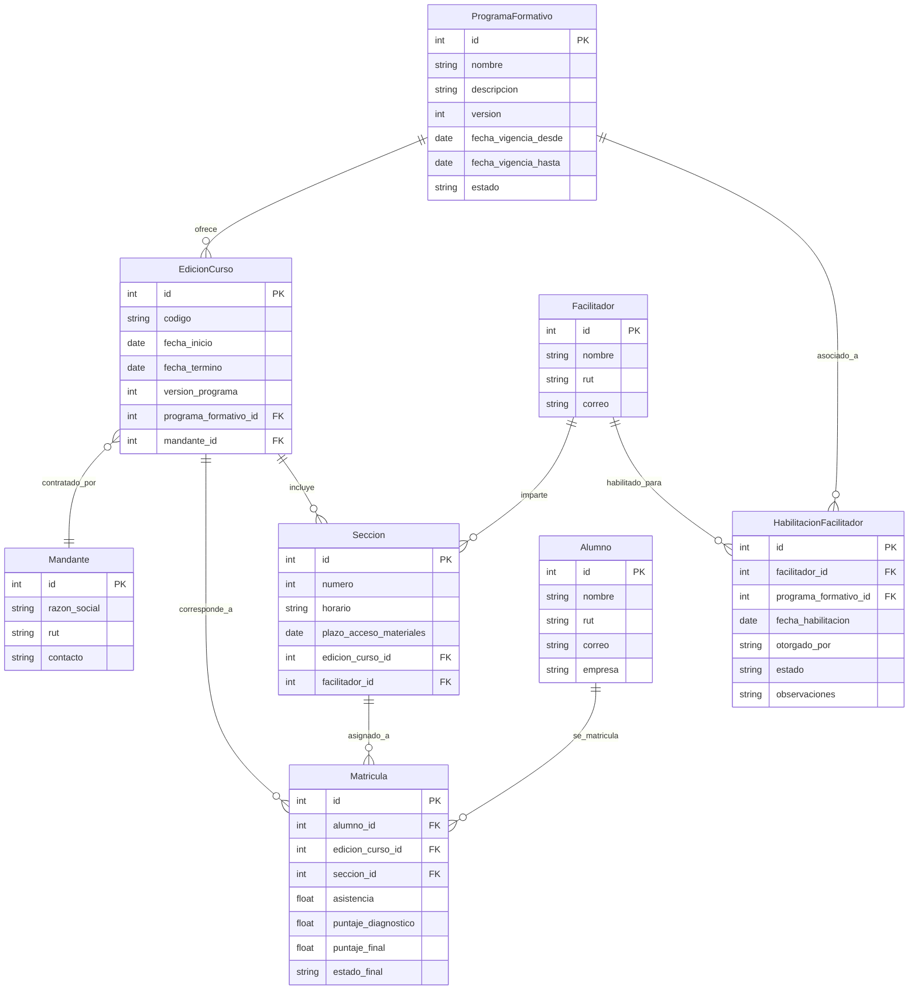

## Diagrama ER

```mermaid
erDiagram

%% =================== ENTIDADES ===================

ProgramaFormativo {
    int id PK
    string nombre
    string descripcion
    int version
    date fecha_vigencia_desde
    date fecha_vigencia_hasta
    string estado
}

EdicionCurso {
    int id PK
    string codigo
    date fecha_inicio
    date fecha_termino
    int version_programa
    int programa_formativo_id FK
    int mandante_id FK
}

Mandante {
    int id PK
    string razon_social
    string rut
    string contacto
}

Seccion {
    int id PK
    int numero
    string horario
    date plazo_acceso_materiales
    int edicion_curso_id FK
    int facilitador_id FK
}

Facilitador {
    int id PK
    string nombre
    string rut
    string correo
}

HabilitacionFacilitador {
    int id PK
    int facilitador_id FK
    int programa_formativo_id FK
    date fecha_habilitacion
    string otorgado_por
    string estado
    string observaciones
}

Alumno {
    int id PK
    string nombre
    string rut
    string correo
    string empresa
}

Matricula {
    int id PK
    int alumno_id FK
    int edicion_curso_id FK
    int seccion_id FK
    float asistencia
    float puntaje_diagnostico
    float puntaje_final
    string estado_final
}

%% =================== RELACIONES ===================

ProgramaFormativo ||--o{ EdicionCurso : ofrece
EdicionCurso }o--|| Mandante : contratado_por
Alumno ||--o{ Matricula : se_matricula
EdicionCurso ||--o{ Matricula : corresponde_a
Seccion ||--o{ Matricula : asignado_a
EdicionCurso ||--o{ Seccion : incluye
Facilitador ||--o{ Seccion : imparte
Facilitador ||--o{ HabilitacionFacilitador : habilitado_para
ProgramaFormativo ||--o{ HabilitacionFacilitador : asociado_a


```