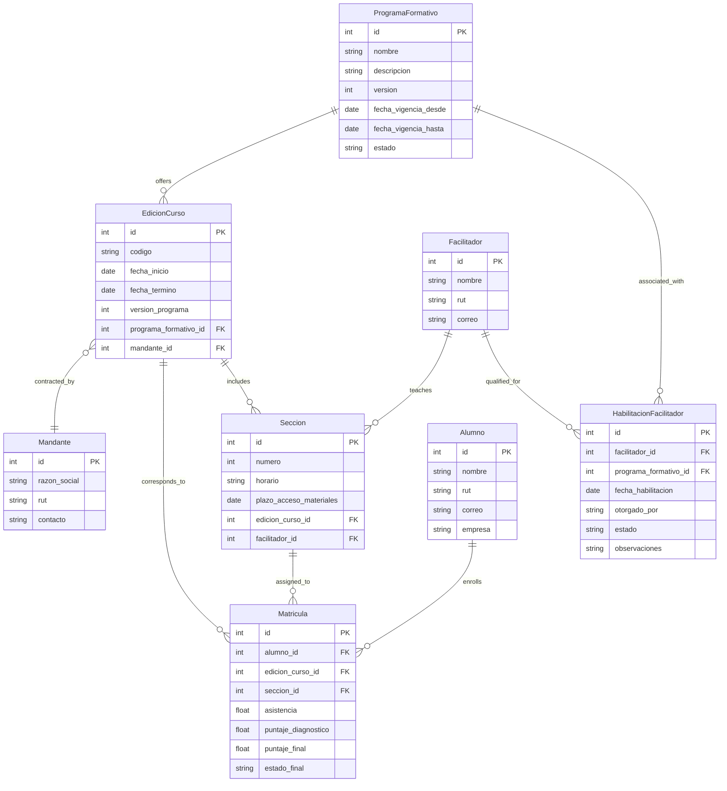

## ER Diagram

```mermaid
erDiagram

%% =================== ENTITIES ===================

ProgramaFormativo {
    int id PK
    string nombre
    string descripcion
    int version
    date fecha_vigencia_desde
    date fecha_vigencia_hasta
    string estado
}

EdicionCurso {
    int id PK
    string codigo
    date fecha_inicio
    date fecha_termino
    int version_programa
    int programa_formativo_id FK
    int mandante_id FK
}

Mandante {
    int id PK
    string razon_social
    string rut
    string contacto
}

Seccion {
    int id PK
    int numero
    string horario
    date plazo_acceso_materiales
    int edicion_curso_id FK
    int facilitador_id FK
}

Facilitador {
    int id PK
    string nombre
    string rut
    string correo
}

HabilitacionFacilitador {
    int id PK
    int facilitador_id FK
    int programa_formativo_id FK
    date fecha_habilitacion
    string otorgado_por
    string estado
    string observaciones
}

Alumno {
    int id PK
    string nombre
    string rut
    string correo
    string empresa
}

Matricula {
    int id PK
    int alumno_id FK
    int edicion_curso_id FK
    int seccion_id FK
    float asistencia
    float puntaje_diagnostico
    float puntaje_final
    string estado_final
}

%% =================== RELATIONSHIPS ===================

ProgramaFormativo ||--o{ EdicionCurso : offers
EdicionCurso }o--|| Mandante : contracted_by
Alumno ||--o{ Matricula : enrolls
EdicionCurso ||--o{ Matricula : corresponds_to
Seccion ||--o{ Matricula : assigned_to
EdicionCurso ||--o{ Seccion : includes
Facilitador ||--o{ Seccion : teaches
Facilitador ||--o{ HabilitacionFacilitador : qualified_for
ProgramaFormativo ||--o{ HabilitacionFacilitador : associated_with


```
