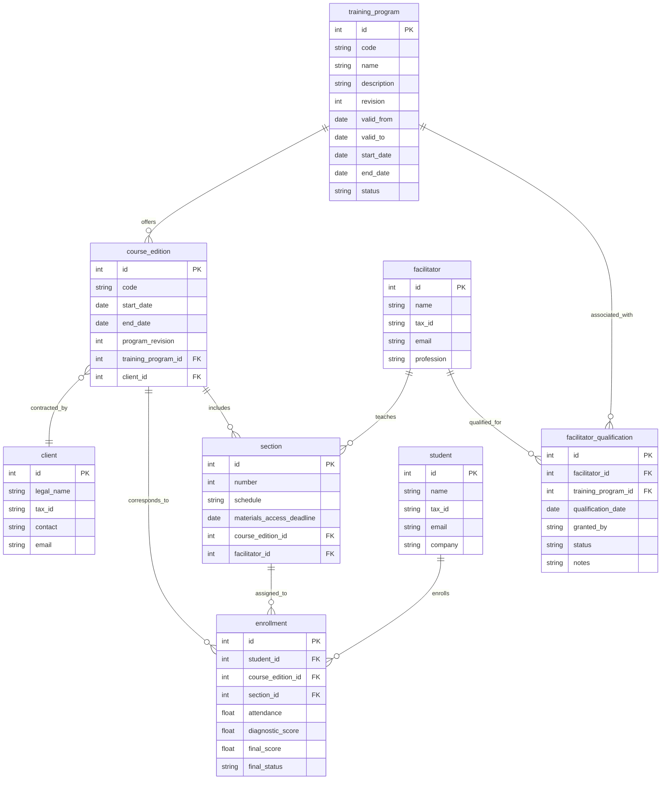

## ER Diagram

```mermaid
erDiagram

%% =================== ENTITIES ===================

training_program {
    int id PK
    string code
    string name
    string description
    int revision
    date valid_from
    date valid_to
    date start_date
    date end_date
    string status
}

course_edition {
    int id PK
    string code
    date start_date
    date end_date
    int program_revision
    int training_program_id FK
    int client_id FK
}

client {
    int id PK
    string legal_name
    string tax_id
    string contact
    string email
}

section {
    int id PK
    int number
    string schedule
    date materials_access_deadline
    int course_edition_id FK
    int facilitator_id FK
}

facilitator {
    int id PK
    string name
    string tax_id
    string email
    string profession
}

facilitator_qualification {
    int id PK
    int facilitator_id FK
    int training_program_id FK
    date qualification_date
    string granted_by
    string status
    string notes
}

student {
    int id PK
    string name
    string tax_id
    string email
    string company
}

enrollment {
    int id PK
    int student_id FK
    int course_edition_id FK
    int section_id FK
    float attendance
    float diagnostic_score
    float final_score
    string final_status
}

%% =================== RELATIONSHIPS ===================

training_program ||--o{ course_edition : offers
course_edition }o--|| client : contracted_by
student ||--o{ enrollment : enrolls
course_edition ||--o{ enrollment : corresponds_to
section ||--o{ enrollment : assigned_to
course_edition ||--o{ section : includes
facilitator ||--o{ section : teaches
facilitator ||--o{ facilitator_qualification : qualified_for
training_program ||--o{ facilitator_qualification : associated_with


```
